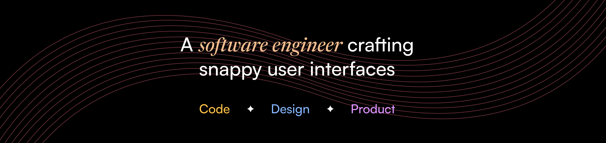

### Hi there! 👋🏽

  
  &nbsp;
  
  &nbsp;
  
  &nbsp;
  

I'm **Javier Diaz** a.k.a. *coderdiaz*, a software engineer who designs snappy interfaces. Interested in design systems, jamstack, user/dev experience, software engineering, and design topics. My goal is to create simple, user-friendly, and faster digital products for everyone!

You can know more about me, visit my website [here](https://coderdiaz.dev/sobre-mi).

- 🔭 I’m currently building a **open-source and self-hosted** alternative to retrieve form submissions and surveys.
- 🌱 I’m currently learning about **Product Design, Motion** and **Golang**.
- 💬 You can ask me about **web development** or specific tech stack, for ex. Node, Nest.js, React, Strapi, and GraphQL.
- If you have a project related to **design** or **development**, you can contact me via email.
- 📫 How to reach me: [@coderdiaz](https://x.com/coderdiaz) on X.com or send me an email to hey[at]coderdiaz.dev.
- 😄 Pronouns: He/Him.
- 📺 Join me on [Twitch](https://twitch.tv/coderdiaz) for exciting streams every Friday and Saturday! We delve into the world of programming and design, creating a vibrant community where you can continue to expand your knowledge of web development. Let's embark on this learning journey together!

I love writing, especially about my work and experiences, which I share on my personal blog about thoughts. If you're interested in web development content, I'm currently writing articles on my new project called [Dimelo en Codigo](https://dimeloencodigo.com/hola-mundo).

### My product tech stack is:
- **Backend:** Node.js, Nest.js, GraphQL, PostgreSQL, Strapi, PayloadCMS.
- **Frontend:** HTML/CSS/JavaScript, React, Radix UI, TailwindCSS, Next.js, Astro, SWR for data fetching, MDX, Figma.
- **Mobile:** React Native, Reanimated.
- **Infrastructure/Devops:** Northflank, Docker, CloudFlare.
- **Programming Languages:** JavaScript, TypeScript, Golang.

If you're curious about my tech stack and the tools I use on a daily basis, you can visit my [uses](https://coderdiaz.dev/que-uso) page.
